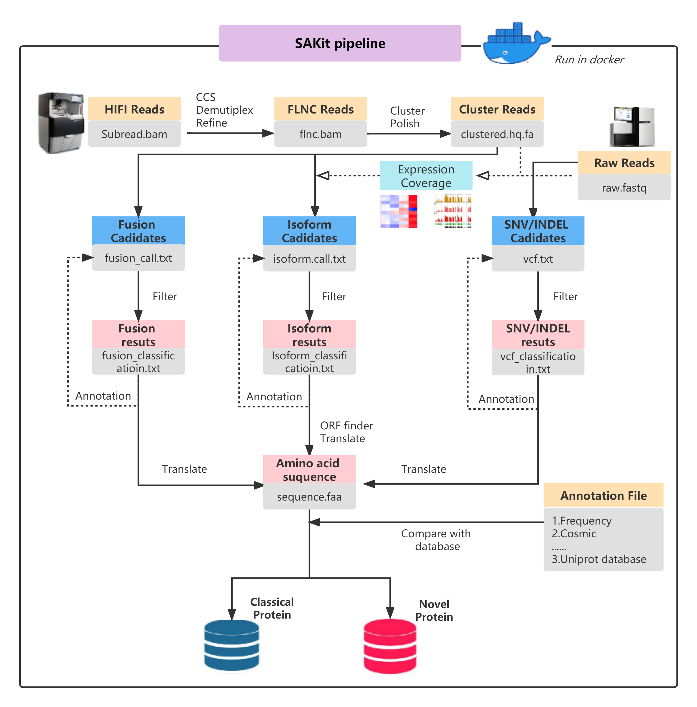

# SAKit overview
  Genetic modifications that cause pivotal protein inactivation or abnormal activation may lead to cell signaling pathway change or even dysfunction, resulting in cancer and other diseases. In turn, dysfunction will further produce “novel proteins” that do not exist in the canonical human proteome. Identification of novel proteins is meaningful for identifying promising drug targets and developing new therapies. In recent years, several tools have been developed for identifying DNA or RNA variants with the extensive application of nucleotide sequencing technology. However, these tools mainly focus on point mutation and have limited performance in identifying large-scale variants as well as the integration of mutations. Here we developed a hybrid Sequencing Analysis bioinformatic pipeline by integrating all relevant detection Kits(SAKit): this pipeline fully integrates all variants at the genomic and transcriptomic level that may lead to the production of novel proteins defined as proteins with novel sequences compare to all reference sequences by comprehensively analyzing the long and short reads. The analysis results of SAKit demonstrate that large-scale mutations have more contribution to the production of novel proteins than point mutations, and long-read sequencing has more advantages in large-scale mutation detection.
  Availability and implementation: SAKit is freely available on docker image (https://hub.docker.com/repository/docker/therarna/sakit), which is mainly implemented within a Snakemake framework in Python language.
    
    <h3 align="midle">
       
                    SAKit pipeline
       
      
       
    </h3>

# Install from github
`git clone git@github.com:wuzengding/pipeline_SAKit.git`

# Utilise
## Prerequisites
